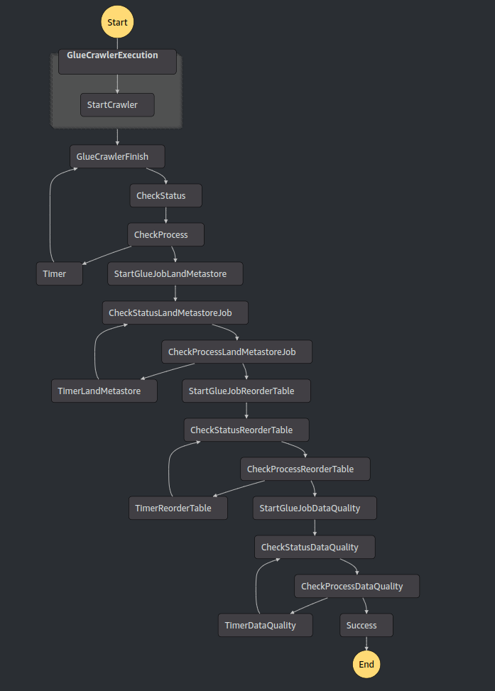

Create a workflow for data quality in Spark using AWS Glue with a Iceberg data lake.
# Workflow

# Missing part
* it is necessary to add permission from the lake formation location manually and allow the database invoke.
* a good improvement could be the create of a medallion architecture.